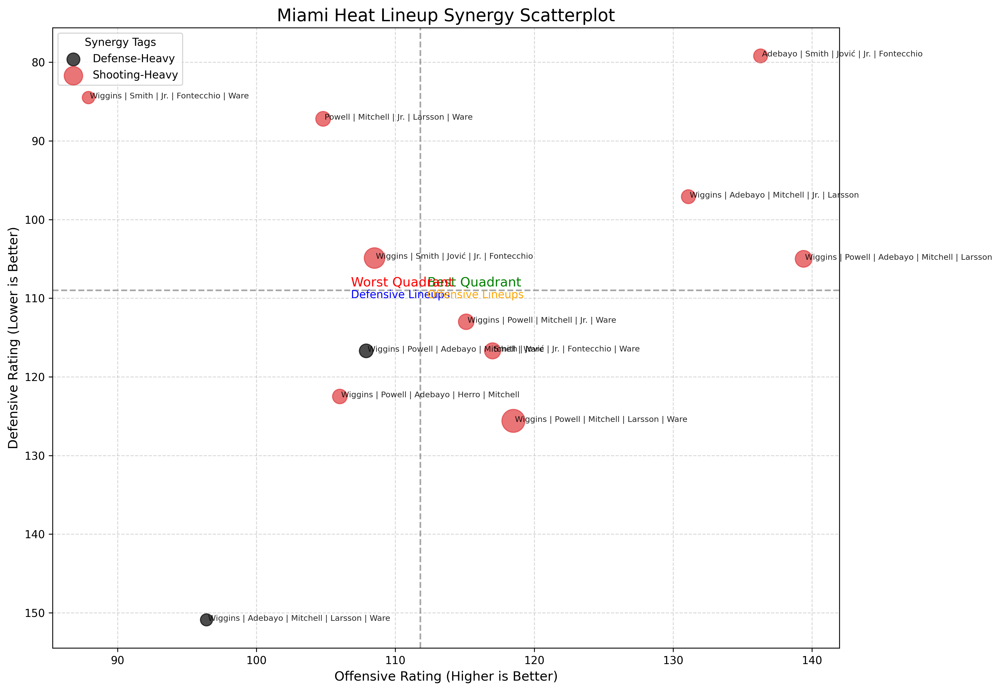

📊 Miami Heat Lineup Synergy Analysis (2025–26 Season)
A data-driven look at lineup efficiency, synergy tags, and early-season trends for the Miami Heat.

🔥 Overview

This project analyzes all 5-man lineups used by the Miami Heat through the early portion of the 2025–26 NBA season, using:
- Python
- nba_api
- pandas
- matplotlib
- Custom synergy tagging logic

The goal is to identify which lineups are most effective — offensively, defensively, and overall — and to visualize how lineup synergy shapes team performance.

🛠️ Features
- Automated lineup data extraction
- Using nba_api to pull all Heat 5-man lineup stats and save them to CSV.
- Player attribute tagging

Each player is manually labeled for:
- Shooting
- Defense
- Shot creation
- Position

✔ Lineup synergy classification
Lineups receive synergy tags like:

- Shooting-Heavy
- Defense-Heavy
- Switchable
- Creator Present
- Bam + Spacing
- Balanced

✔ Visualization Suite

Includes:

- Top-10 Net Rating bar chart
- Lineup synergy scatterplot
- Quadrant analysis (OffRtg vs DefRtg)
- Bubble size = minutes played
- Labels for each lineup (clean formatted last names)

📈 Example Visual: Synergy Scatterplot

🗂️ Project Structure
Miami-Heat-Lineup-Synergy/
│
├── data/
│   ├── raw/            # CSV from API
│   └── processed/      # future outputs
│
├── notebooks/
│   └── 01_lineup_synergy_eda.ipynb
│
├── src/
│   ├── get_lineups.py
│   └── __init__.py
│
├── images/             # visualizations for README
├── requirements.txt
└── README.md

🧩 How It Works (Short Version)

1. Run get_lineups.py to pull all Heat lineups.
2. Load data in Jupyter Notebook.
3. Filter and sort by minutes played + Net Rating.
4. Assign synergy tags based on player attributes.
5. Create bar charts and scatterplots.
6. Interpret lineup performance.

🚀 Future Improvements

- Automated nightly data refresh
- Interactive Plotly charts
- Shot charts & defensive heat maps
- Lineup clustering using ML
- Synergy dashboard (Streamlit)

👤 Author

Ezra Enchill
Miami Heat fan • Data science learner • Breaking into sports analytics

If you enjoyed the project, feel free to connect or reach out!
